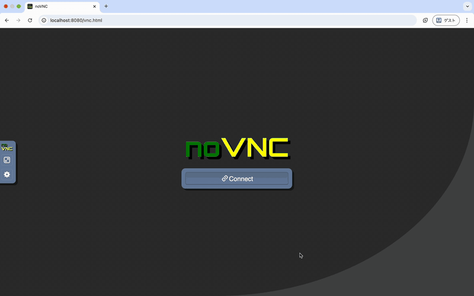

# Daneel

Layered, container-based development environments for ROS 2.

- **Daneel**: a set of reusable base images
- **Daneel_template**: a template repository for stacking your own project-specific layers on top of Daneel

---

## What is Daneel?

**Daneel** is a set of container images that act as a **foundation for ROS 2–centric robotics development**.

The goals are:

- Reproduce the same development environment on different hosts with minimal friction
- Provide a browser-accessible Linux desktop when you need a GUI
- Deploy a **lightweight, non-GUI runtime image** on robots or remote machines
  
To achieve this, Daneel provides two main image layers:

- a **base layer** for common CLI / ROS 2 tooling
- a **desktop layer** for GUI-based development via noVNC

---

## Layer structure

The core of Daneel consists of the following two layers.

### 1. Base layer

The base layer collects tools and settings that are commonly needed across ROS 2 projects, for example:

- Consistent user / UID / GID setup
- Basic CLI tools and utilities
- ROS 2 installation and setup
- Shared shell scripts, aliases, and other quality-of-life tweaks

**Idea:**  
By putting “things you always want” into this layer,  
project-specific layers on top can stay as thin as possible.

### 2. Desktop layer

The desktop layer builds **on top of the base layer**, and adds a GUI environment, such as:

- noVNC + a lightweight window manager (e.g. Fluxbox)
- A browser-accessible Linux desktop where you can run VS Code, RViz2, etc.
- Configurable resolution, ports, wallpaper, and more via environment variables

**Idea:**  
The GUI is strictly kept inside the desktop layer, so you can:

- Use the **desktop image** for interactive development
- Use a **runtime image based on the base layer only** on robots / servers

This separation makes it easier to treat the UI as optional.

---

## Relationship to Daneel_template

Daneel itself only provides **generic base images**.  
For real projects, you will typically want to add project-specific layers on top.

This is where **[Daneel_template](https://github.com/ReitaY/Daneel_template)** comes in.

With `Daneel_template`, you can structure your project like:

- `myproject-runtime`  
  - `FROM` the Daneel base layer
  - Adds project-wide dependencies and tools
- `myproject-desktop`  
  - `FROM` the Daneel desktop layer
  - Adds project-specific GUI tools, configs, and shortcuts

This yields a clear split:

1. **Daneel**: a reusable, ROS 2–oriented base environment
2. **Daneel_template + your Dockerfiles**: thin project-specific layers stacked on top

---

## Example

Example desktop session using the Daneel desktop layer:

  

> Example: a noVNC desktop opened in the browser, running Xterm and RViz2.

---

## Motivation and name

Daneel started from a very practical pain point:

- Robotics development often spans **multiple machines**: laptops, workstations, Jetsons, remote servers…
- Reinstalling ROS 2 and tooling on each machine is tedious and error-prone
- It would be nice to **open the same desktop environment from anywhere**, and deploy a minimal runtime on the robot

By introducing a **layered structure with a separated UI**, Daneel aims to make this easier:

- Use the **desktop layer** locally for comfortable development
- Use **base-derived runtime images** on robots and headless machines

### Background

> “A knotty puzzle may hold a scientist up for a century, when it may be that a colleague has the solution already and is not even aware of the puzzle that it might solve.”  
> — Isaac Asimov

This project is named after **R. Daneel Olivaw**, the humanoid robot from Isaac Asimov’s robot series.

Daneel brings that idea into **ROS 2 robotics development**:  
it aims to reduce friction around environments, make it easy to run great ROS 2 projects without fighting your setup, and help you discover unexpected ways to reuse existing work.

By layering reusable base and desktop environments and sharing a common template, Daneel will keep evolving as a platform where you can **reuse, combine, and repurpose ROS 2 projects with as little hassle as possible**.
